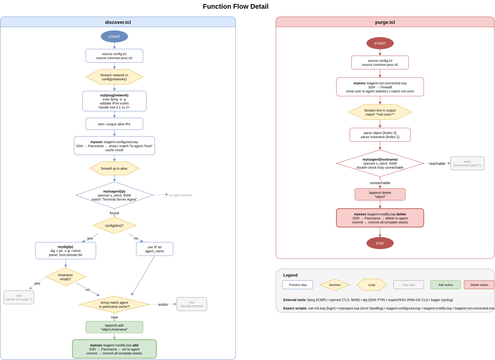

# Development

## Testing

Tests use Tcl's built-in `tcltest` package -- no additional dependencies required beyond `tcl`.

### Run tests

```shell
tclsh src/tests/common-proc.test.tcl
expect src/tests/myexpect.test.tcl
expect src/tests/exp-e2e.test.tcl
```

Or run everything -- the three suites above plus all four fuzz harnesses
below -- in one shot:

```shell
src/tests/run-all.sh                            # tests + fuzz
src/tests/run-all.sh --tests-only                # skip fuzz
src/tests/run-all.sh --fuzz-only                 # skip tcltest/expect suite
src/tests/run-all.sh --iterations 5000 --seed 42 # forwarded to each fuzz harness
```

### What is tested

The test suite validates the core logic with mocked external commands (no network or SSH required).

**common-proc.tcl procedures**
- `log` -- newline replacement, message truncation at 200 chars, syslog level forwarding, and that a failing `logger` call is caught and falls back to stdout instead of aborting the run (syslog is the secondary sink; it must not be able to take down discover.tcl/purge.tcl)
- `myexec` -- results passthrough on success, exit-1 on non-zero CHILDSTATUS and on other exec errors, logging of args/results at `info` on success and `error` on either failure path
- `myfping` -- IPv4 address validation/filtering, fping exit code handling (0, 1, 2+), and that a stray unbalanced brace/quote in `fping`'s raw output can't throw uncaught (it's split on `\n` rather than parsed as an implicit Tcl list -- see `fuzz-myfping.test.tcl` below)
- `mytsagent` -- TLS certificate string matching, error code handling (1, 104, etc)
- `mydig` -- hostname passthrough on success, exit-1 on failure, error-level logging on failure

**exp/myexpect.exp**
- Branch coverage for every named pattern (`Unknown command`, HA sync warning, platform-capacity commit failure, generic error/invalid/fail catch-alls, timeout)
- `Object doesn't exist` -> warns, increments a `skipped_deletes` counter, and keeps waiting on the same expect (`exp_continue`) instead of aborting, so a prompt arriving right after it still completes the call normally
- Priority: the platform-capacity branch is confirmed to win over the generic error/fail catch-alls when a message matches both
- A clean prompt match with no error keywords returns normally
- A simulated multi-object delete batch (`run_delete_batch`, driven against a fake PAN-OS-like CLI spawned via `/bin/sh`) confirms the real send/myexpect loop used by `tsagent-modify-panorama.exp`/`tsagent-modify-firewall.exp` processes every object in order without desyncing when some deletes hit "Object doesn't exist" and others don't, and that `skipped_deletes` tallies exactly the missing ones

This suite uses `expect` (not `tclsh`) since `myexpect.exp` drives the real `expect` command against a spawned process rather than pure Tcl logic. It spawns `/bin/echo`/`sleep`/`sh` in place of an SSH session and asserts on the resulting exit code.

**exp/exp-e2e.test.tcl**

End-to-end coverage for the four `.exp` scripts `myexpect.test.tcl` doesn't touch: `tsagent-configured.exp`, `tsagent-not-connected.exp`, `tsagent-modify-firewall.exp`, `tsagent-modify-panorama.exp` (and, transitively, `ssh-init.exp`, which all four `source`). These are `source`d unmodified rather than mirrored, so their real `send`/`myexpect` control flow, real commit-vs-skip arithmetic, and real `send` line construction execute for real.

A real SSH session was not viable: this sandbox pins the `ssh` binary regardless of `PATH` (shadowing any other binary name via `PATH` works fine -- verified directly -- only `ssh` specifically does not), and even where that's not a constraint, `ssh-init.exp` hardcodes port 22 with no `-p` override, so a local test `sshd` would need a privileged bind. Instead the harness renames and wraps Expect's own `spawn` command (the same rename-and-wrap mock pattern `common-proc.test.tcl`/`myexpect.test.tcl` already use for `exec`/`exit`): a `spawn ssh ...` call is redirected to a local fake PAN-OS CLI shell script instead, everything else passes through untouched. `exit` is mocked the same "record and return" way `myexpect.test.tcl` uses (throwing corrupts Expect's internal state), and the real `sleep`/`after` calls in `ssh-init.exp`/`tsagent-modify-panorama.exp` are intercepted so the suite doesn't pay their wall-clock cost. The fake CLI is a small POSIX-shell state machine (operational vs. config mode, since "exit" means something different in each) that logs every line it receives, which the test then reads back to assert on the exact commands the real `.exp` file sent -- including the previously-undocumented `tsagent-modify-panorama.exp`/`tsagent-modify-firewall.exp` commit-skip-when-nothing-modified branch (computed from `[llength $input] - skipped_deletes - skipped_gate`), and that `tsagent-modify-panorama.exp` sends exactly one `commit-all` per configured template-stack.

This harness found, and was used to verify the fix for, a real injection bug: `$input` in both `tsagent-modify-firewall.exp` and `tsagent-modify-panorama.exp` is walked with `foreach i $input`, which parses `$input` as a Tcl *list* -- and Tcl list-whitespace includes `\r`, not just space/tab/newline. A single `"object,host"` add entry with an embedded `\r` fanned out into extra list elements, one of which became a live `send "set vsys vsys1 ts-agent legituser01 host  port 5009 disabled no\r"` -- silently overwriting an unrelated, already-configured agent's host with an empty value. `discover.tcl`'s PTR gate and `purge.tcl`'s object/hostname gate (see below) both already exclude `\r`, so this wasn't reachable via either caller today, but neither `.exp` file independently validated `$object`/`$host` before building its `send` line -- exactly the "don't assume downstream callers re-validate" scenario. Fixed by adding the same `^[A-Za-z0-9._-]+$` gate to both files' add/delete loops (mirrored, since a change to one almost always needs the same change in the other), with a `skipped_gate` counter folded into the `modified` arithmetic so an all-rejected batch doesn't trigger a needless commit. `e2e-firewall-add-crlf-injection-blocked`/`e2e-panorama-add-crlf-injection-blocked` regression-guard this; `e2e-firewall-delete-glob-metachars-rejected` covers the same gate rejecting glob metacharacters in a delete object name.

The full control flow being tested below, for both scripts:

[](function-flow.drawio)

**discover.tcl logic**
- Panorama config pattern matching (DNS and IP modes)
- Firewall-mode config pattern matching (DNS and IP modes, multi-agent)
- Multi-agent and wrong-template rejection
- FQDN parsing (hostname, domain, TLD extraction), including characterization tests (`discover-agent-host-*`) pinning down the current, known-truncating behavior for PTR values with other than 3 dot-separated labels -- see the "KNOWN LIMITATION" comment above the split in `discover.tcl`. `agent_host` is a display/label value only (PAN-OS doesn't resolve it to connect, and the "already configured" match keys on `agent_name`), so this is believed cosmetic, not yet changed pending confirmation
- IP deduplication
- Add-list `object,hostname` format construction and parsing

**purge.tcl logic**
- `not-conn:` line pattern matching
- Object and hostname extraction from firewall output
- Multi-line output filtering with mixed connected/not-connected agents
- Combined decision logic (`purge_decide`): a not-conn agent is only deleted if it *also* fails the `mytsagent` recheck; connected lines are never evaluated; a malformed line is skipped without disturbing other lines in the same batch
- Object/hostname charset gate (`purge-decide-rejects-embedded-cr-in-*`): a line that parses cleanly as a Tcl list (no brace/quote error) can still carry a literal `\r` through a brace-/quote-grouped field -- `lindex`'s list parsing treats a bare `\r` as inter-element whitespace, but a grouped field lets one survive extraction. `purge.tcl` gates `object`/`hostname` through the same `^[A-Za-z0-9._-]+$` regex `discover.tcl` applies to PTR values before either reaches a live `send`/`exec`

### Test approach

External commands (`fping`, `openssl`, `dig`, `logger`, `ssh`) are mocked at the `exec` level. The `exit` command is also mocked so fatal error paths can be tested without terminating the interpreter. In `common-proc.test.tcl` the mock `exit` raises a catchable error; in `myexpect.test.tcl` it instead just records the code, since throwing an error out of an `expect` action block corrupts Expect's internal state. Note also that `spawn` sets `spawn_id` in the calling proc's local scope -- if you spawn from inside a test helper proc, `global spawn_id` is required before the spawn or `myexpect`'s own `expect` call won't find it and will hang until timeout.

Tests focus on the pure logic and string parsing that is most likely to break during refactoring -- the parts you can validate without live infrastructure.

### Adding tests

Place new test files in `src/tests/` using the `*.test.tcl` naming convention and the same mock pattern established in `common-proc.test.tcl`.

## Fuzzing

```shell
tclsh src/tests/fuzz-injection.test.tcl [iterations] [seed]
tclsh src/tests/fuzz-purge-parsing.test.tcl [iterations] [seed]
tclsh src/tests/fuzz-log.test.tcl [iterations] [seed]
tclsh src/tests/fuzz-myfping.test.tcl [iterations] [seed]
```

All four harnesses are seeded (default seed `1`) so a failing run is reproducible, and all exit 0 on a clean run / 1 with repro cases printed on a violation. None are wired into `common-proc.test.tcl`'s pass/fail suite -- run them separately.

### fuzz-injection.test.tcl

`mydig`'s output is a reverse DNS PTR record, which is attacker-influenceable if the attacker controls DNS for a scanned subnet. That string flows with no sanitization into live PAN-OS CLI `send` commands and into `string match` glob patterns. This harness replicates that data pipeline (FQDN split -> CSV add-list encode/decode -> CLI command construction -> the "already configured" `string match` check) and generates adversarial hostnames against it -- a fixed corpus of named edge cases plus randomized mutations.

It checks three invariants:

- **no-crlf** -- a PTR value containing `\r`/`\n` could inject a second command into the live SSH session (e.g. a PTR record of `server01<CRLF>delete template ... ts-agent legituser01` would delete an unrelated agent).
- **csv-roundtrip** -- a PTR value containing a comma would corrupt the `"$agent_name,$agent_host"` encoding used to pass discovered hosts to `tsagent-modify-*.exp`, desyncing the object name from its host.
- **glob-injection** -- discover.tcl's "already configured" check (`string match "*...ts-agent $agent_name*" $existing`) treats `agent_name` as a glob pattern, not a literal string. A PTR value of `*` (or containing `*`/`?`/`[`) would make every existing-agent check succeed regardless of the real name, so the tool would silently believe any host is already configured and never add it.

This harness originally found live violations of all three, fixed by a validation gate right after the `mydig` call in `discover.tcl`: any PTR record outside a plain hostname charset (`^[A-Za-z0-9._-]+$`) is rejected (`continue`, logged at `error` level) before `agent_name`/`agent_host` are ever derived from it. That closes all three at once since none of the three payload shapes are valid hostname characters. The harness's `pipeline_valid_ptr` mirrors that same regex so it accurately reflects the fixed pipeline.

This harness covers `discover.tcl`'s path (DNS mode) specifically. `purge.tcl`'s `$object`/`$hostname` mostly inherit the fix transitively (they come from the firewall's own `not-conn` stats output for agents that were already accepted through this same gate) -- but `purge.tcl` also independently re-validates them with its own gate (see `fuzz-purge-parsing.test.tcl` below), since a `not-conn` line's fields aren't parsed the same way a PTR record is, and a brace-/quote-grouped field can carry a `\r` through in a way a plain hostname split can't.

### fuzz-purge-parsing.test.tcl

`purge.tcl` parses each `not-conn` line with plain `lindex`, which parses the line as a Tcl *list* -- an unbalanced brace or quote anywhere in the device's output throws a real Tcl error (`unmatched open brace/quote in list`). Without a catch around it, that error would propagate uncaught and abort the whole purge run, leaving stale agents unremoved -- a concrete mechanism for the "purge script has failed" scenario documented in `docs/TROUBLESHOOTING.md`'s platform-capacity section.

This harness generates adversarial single lines (unbalanced braces/quotes, trailing backslashes, oversized input, and -- since a later pass added a second invariant, see below -- braced/quoted fields carrying literal `\r`/`\n`) plus batches that sandwich one adversarial line between two well-formed ones, and checks that `purge.tcl`'s per-line `catch` (added alongside this harness) never lets a parse error escape, and that one malformed line never takes out its neighbors in the same batch.

It also checks a **no-crlf**/**gate-bypass** invariant: a line that survives `purge.tcl`'s object/hostname charset gate (see the purge.tcl logic section above) must never carry a raw `\r`/`\n`, and must never contain a character outside `^[A-Za-z0-9._-]+$`, into the live `send`/`exec` pipeline. This is the same class of check `fuzz-injection.test.tcl` already did for `discover.tcl`'s PTR path; before the gate was added, a not-conn line with a brace-grouped field (e.g. `{server\r01}   10.0.0.1 ... not-conn: ...`) parsed cleanly as a Tcl list but let a literal `\r` reach `$object`, which `purge.tcl` then fed into a live `send "...ts-agent $object\r"` -- a real, previously-untested injection path this harness now regression-guards.

### fuzz-log.test.tcl

The shared `log` proc (`src/inc/common-proc.tcl`) is the one function every logged event in both scripts passes through on its way to syslog -- and some of what reaches it is attacker-influenceable, e.g. discover.tcl logs the raw, unvalidated PTR value when it rejects one (the "security-relevant" alert in `docs/SPLUNK_ALERTS.md`), and purge.tcl logs the raw, unparsed `not-conn` line from firewall CLI output. This harness mocks `exec`/`logger` (so it never touches the real host syslog) and runs adversarial messages -- control characters, bare `\r` without `\n`, mixed line endings, oversized/multibyte content -- directly through the real `log` proc, with the mock `logger` alternating between succeeding and failing on each case.

It checks four invariants:

- **no-throw** -- `log` must never raise an uncaught error, regardless of message content or whether the `logger` call itself succeeds or fails. Syslog is the secondary/redundant sink; a failure writing to it must not be able to abort a discover.tcl/purge.tcl run mid-batch.
- **no-raw-crlf** -- the message argument actually handed to `logger` must never contain a raw `\r` or `\n`. This harness originally found a live violation: the truncation/sanitization regex only matched `\n`, so a bare `\r` (no accompanying `\n`) passed through untouched. That matters because a stray `\r` lets logged content visually overwrite/hide the line in a terminal-based log viewer (`tail`/`less`) -- a CWE-117 log-forging trick -- directly undermining the one log line documented as security-relevant. Fixed by replacing the `\n`-only regsub with one that collapses `\r\n`, lone `\r`, and lone `\n` uniformly.
- **length-bound** -- the message body must never exceed 200 chars (plus the `...` truncation suffix), regardless of input length or byte content.
- **logger-attempted** -- `log` must still attempt the `logger` call (not silently skip it) even when it's set to fail, so the fallback-to-stdout path (see below) only engages on a genuine failure, not as a shortcut.

Also caught in the same pass: `log`'s `exec logger` call was itself unguarded -- every other `exec` in the codebase (`myexec`, `myfping`, `mytsagent`, `mydig`) is wrapped in `catch`, but this one wasn't. A missing `logger` binary, unreachable `/dev/log`, or a stopped syslog daemon would throw an uncaught Tcl error out of `log` and crash the entire run. Fixed by wrapping the call in `catch` and falling back to `puts` (still captured by the cron file-log redirect) on failure -- see "Logger unavailable" in `docs/TROUBLESHOOTING.md`.

### fuzz-myfping.test.tcl

`myfping`'s job is "strip non-ipv4 address from the returned data" -- its output feeds straight into `discover.tcl`'s main host loop (`mytsagent`/`mydig` get called per surviving entry), so a value it wrongly lets through as "valid" propagates further than one that's correctly filtered out. This harness mocks `exec` to return adversarial `fping -a -g` output (never touching the real binary) and checks two invariants:

- **no-throw** -- `myfping` must never raise an uncaught error for any `fping` output content. This harness exists because exactly this was found: `foreach ip $results` parsed `fping`'s raw output as an implicit Tcl list (the same class of bug `fuzz-purge-parsing.test.tcl` regression-guards on the purge.tcl side), and a stray unbalanced brace/quote token threw `unmatched open brace in list` uncaught -- with no per-line `catch` protecting it the way `purge.tcl` has, this would have crashed the entire `discover.tcl` run. Fixed by splitting on `\n` first (`split` never throws) instead of relying on `foreach`'s implicit list parsing.
- **well-formed-output** -- every IP `myfping` returns as "valid" must actually be a syntactically well-formed dotted-quad (4 groups of 1-3 digits, each 0-255). This harness also found a live violation here: the per-octet check used `string is digit`/`expr`'s `>=`/`<=`, both of which are Unicode-aware -- a non-ASCII decimal digit (e.g. Arabic-Indic `٥`, U+0665) satisfies both, so a garbage token could be accepted as a "valid" octet. Fixed by requiring a strict ASCII `^[0-9]{1,3}$` match before the numeric range check.
