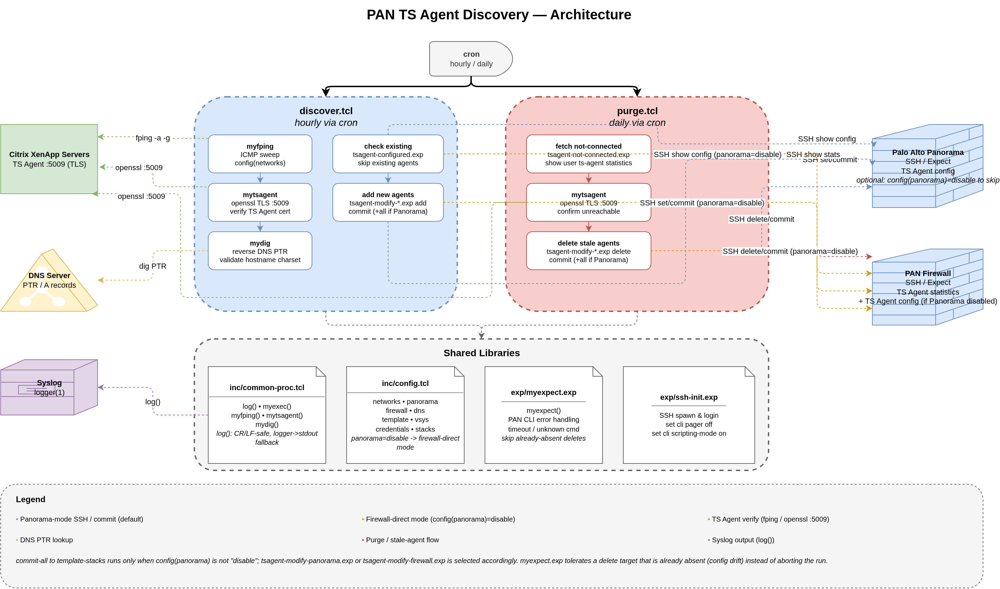
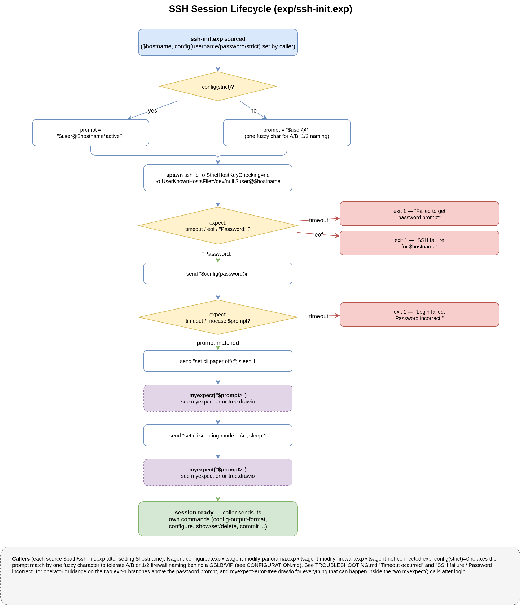
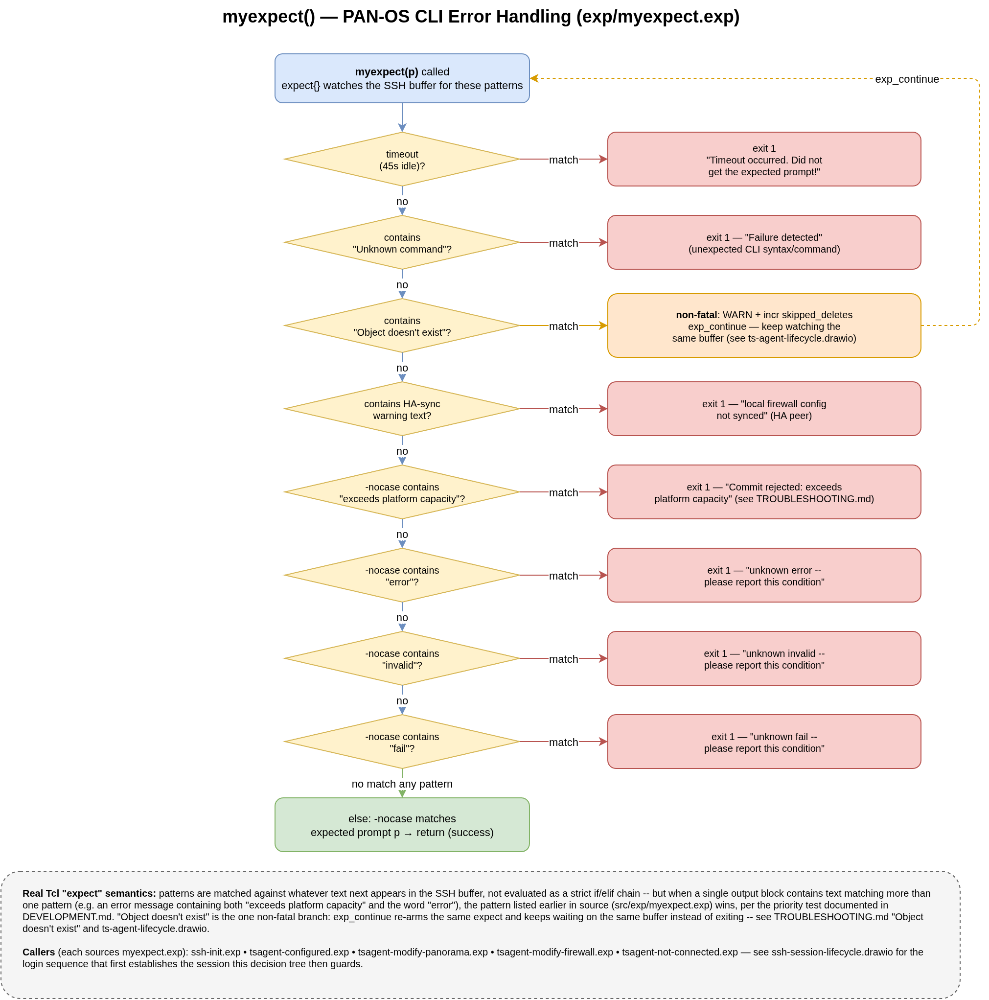
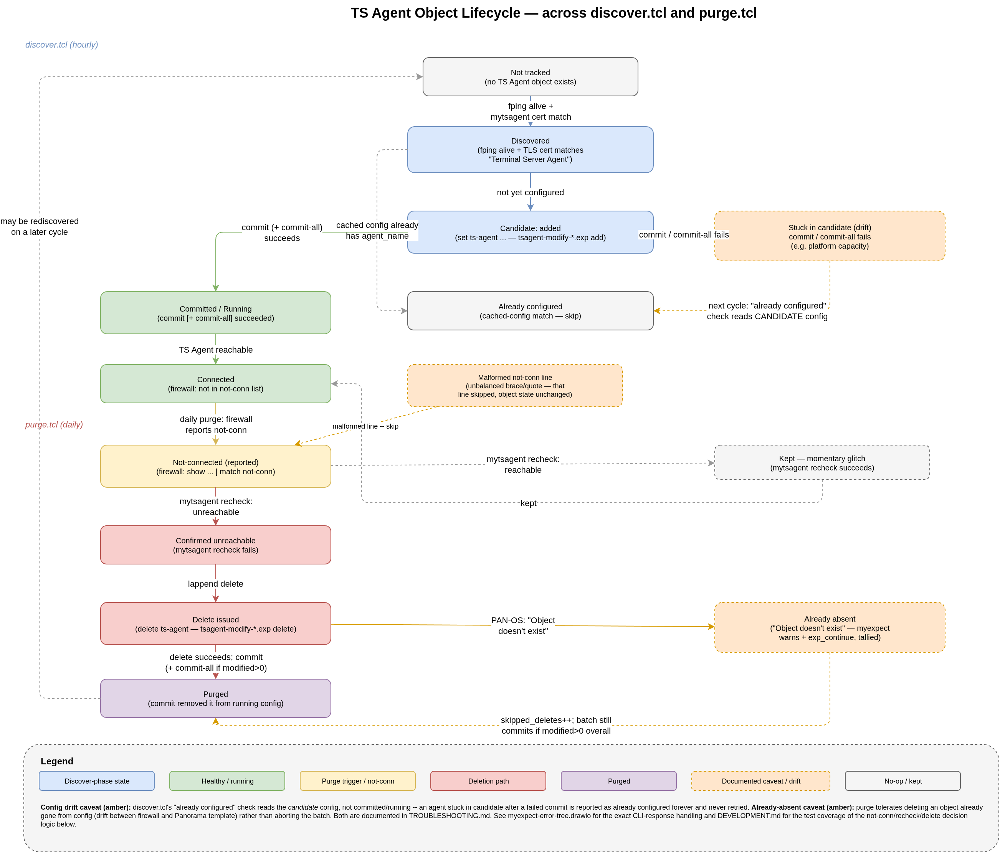

# Documentation

- [CONFIGURATION](CONFIGURATION.md) -- config.tcl parameter reference
- [INSTALL](INSTALL.md) -- Docker and manual setup
- [DEVELOPMENT](DEVELOPMENT.md) -- testing and contributing
- [TROUBLESHOOTING](TROUBLESHOOTING.md) -- logs, PAN-OS CLI checks, common errors
- [SPLUNK_ALERTS](SPLUNK_ALERTS.md) -- SPL searches and alert definitions for logged error conditions

## Diagrams

One page per file (split out for easier standalone viewing/diffing). Click a diagram to open its editable `.drawio` source; PNGs are exported at 2x scale via `drawio2png`.

### [architecture.drawio](architecture.drawio)

System topology -- Citrix/DNS/Panorama/Firewall/syslog, discover.tcl and purge.tcl at a glance, Panorama-vs-firewall-direct mode.

### [function-flow.drawio](function-flow.drawio)

Detailed flowchart of discover.tcl and purge.tcl.

### [ssh-session-lifecycle.drawio](ssh-session-lifecycle.drawio)

ssh-init.exp login handshake (spawn, password prompt, pager/scripting-mode setup).

### [myexpect-error-tree.drawio](myexpect-error-tree.drawio)

myexpect.exp's priority-ordered PAN-OS CLI error/response handling.

### [ts-agent-lifecycle.drawio](ts-agent-lifecycle.drawio)

A TS Agent object's state across discover.tcl and purge.tcl, including the candidate-config-drift and already-absent-delete caveats from TROUBLESHOOTING.md.

### [log-alert-pipeline.drawio](log-alert-pipeline.drawio)

log() -> logger/stdout fallback -> syslog -> Splunk, mapped to the SPLUNK_ALERTS.md alert catalog.

### [flows.png](flows.png)

Traffic flow overview.
