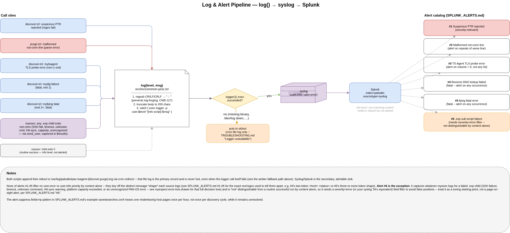

# Splunk Alerts

SPL and alert definitions for the `error`-level events the scripts write to syslog,
assuming host syslog is already flowing into Splunk (no file monitoring/onboarding
covered here).

## Log format

The full path from call site to alert, including the `logger`-failure fallback and where each numbered alert below keys in:

[](log-alert-pipeline.drawio)

Both scripts log through the shared `log` proc in `src/inc/common-proc.tcl`:

```tcl
exec logger -p user.${level} "[info script] ${m}"
```

The invoking script's path (e.g. `.../discover.tcl` or `.../purge.tcl`) is the first
token of the message body -- it's plain text in the message, not a separate syslog
field, so match it as a substring rather than a `tag=` field. Adjust
`sourcetype`/`index` below to whatever your syslog input uses (commonly
`sourcetype=syslog`).

None of the SPL below filters on the `user.error` vs `user.info` priority itself --
which Splunk field (if any) carries that depends on your syslog TA/sourcetype, so
these searches key off message *content* only. If your input parses priority into a
field (e.g. `syslog_severity` or similar), add `severity=error` (or equivalent) to
each search below for a tighter match.

**Scope note:** the errors documented in
[TROUBLESHOOTING.md](TROUBLESHOOTING.md#common-errors) -- SSH failure, session
timeout, HA sync warning, platform capacity exceeded, unrecognized PAN-OS error -- are
written via `send_user` in the `.exp` scripts, not the `log` proc directly. But all
four `.exp` sub-scripts (`tsagent-configured`, `tsagent-modify-firewall`,
`tsagent-modify-panorama`, `tsagent-not-connected`) are invoked through `myexec`
(`src/inc/common-proc.tcl`), which captures the failed child's combined output --
including whatever it `send_user`'d -- into `$results` and logs it via `log`. So
these *do* reach syslog, at `user.error` once the child exits non-zero (`user.info`
on success), just truncated to 200 chars by the `log` proc; the full untruncated text
is only in the cron-redirected file log. See alert #6 below.

## Alert catalog

Discovery runs hourly (`:15`), purge runs daily (`05:30`) -- see
[INSTALL.md](INSTALL.md#crontab). Size each search window to comfortably cover one
cron interval.

| # | Condition | Source | Log line matched |
|---|-----------|--------|-------------------|
| 1 | Suspicious PTR record rejected | discover.tcl | `suspicious PTR record for * skipping:` |
| 2 | Could not parse `not-conn` line | purge.tcl | `purge: could not parse not-conn line, skipping:` |
| 3 | TS Agent TLS probe error (incl. ECONNRESET) | discover.tcl (mytsagent) | `<host> <status>` at `user.error`, two tokens |
| 4 | Reverse DNS lookup failed | discover.tcl (mydig) | `mydig <ip> <status> ...` |
| 5 | fping fatal error (exit 2+) | discover.tcl (myfping) | `<args> <status> <results>` at `user.error`, 3+ tokens |
| 6 | `.exp` sub-script failure (SSH, timeout, unknown command, HA sync, platform capacity, unrecognized error) | discover.tcl / purge.tcl (myexec) | myexec output not matched by #1-#5/#7's shapes (needs a priority filter, see below) |
| 7 | Suspicious not-conn object/hostname rejected | purge.tcl | `purge: suspicious not-conn object/hostname, skipping:` |

### 1. Suspicious PTR record rejected

Security-relevant: fires when `discover.tcl`'s PTR validation (`^[A-Za-z0-9._-]+$`)
rejects a value that would otherwise flow unsanitized into a PAN-OS CLI command. A
single hit can be a DNS misconfiguration; a burst, or one from an unexpected subnet,
warrants checking who controls that PTR record.

```spl
index=paloalto sourcetype=syslog "discover.tcl" "suspicious PTR record"
| rex field=_raw "suspicious PTR record for (?<ip>\S+), skipping: (?<ptr_value>.+)$"
| table _time ip ptr_value
```

### 2. Could not parse `not-conn` line

Doesn't abort the run -- alert on repeats of the *same* line rather than a single
occurrence, since one-off CLI formatting glitches are expected:

```spl
index=paloalto sourcetype=syslog "purge.tcl" "could not parse not-conn line"
| rex field=_raw "skipping: (?<line>.+?) \("
| stats count by line
| where count > 1
```

### 3. TS Agent TLS probe error

Covers any non-1 exit from the port 5009 probe, including the ECONNRESET (104) case
noted in TROUBLESHOOTING.md. `mytsagent` logs only `<host> <status>` -- two
whitespace-separated tokens, nothing else -- so match on that shape rather than the
`## Error` banner, which is `puts` to the file log only and never reaches syslog.
Expected occasionally; alert on volume rather than any single hit:

```spl
index=paloalto sourcetype=syslog "discover.tcl"
| rex field=_raw "discover\.tcl (?<body>.+)$"
| regex body="^\S+\s+\d+$"
| stats count
| where count > 5
```

### 4. Reverse DNS lookup failed

`mydig` errors are fatal -- they `exit 1` and halt `discover.tcl` -- so alert on any
occurrence:

```spl
index=paloalto sourcetype=syslog "discover.tcl" "mydig"
```

### 5. fping fatal error

Also fatal (halts `discover.tcl`). `myfping` only calls `log "error"` when
`$status && $status != 1` -- exit `1` (some hosts unreachable, normal for subnet
scans) never reaches this level, so there's no need to filter it back out in SPL.
The logged shape is `<args> <status> <results>` -- 3+ tokens, which is how this is
told apart from search 3's 2-token `<host> <status>` shape:

```spl
index=paloalto sourcetype=syslog "discover.tcl"
| rex field=_raw "discover\.tcl (?<body>.+)$"
| regex body="^\S+\s+\d+\s+\S"
```

Both searches key off the two/three-token content shape rather than a shared
`## Error` text marker -- that banner is `puts` to the file log only (both `myexec`
and `mytsagent`/`myfping` print it after logging, never through `logger`) and never
appears in syslog. Neither shape can currently occur at `info` level, so they don't
need an explicit priority filter to avoid false positives from successful runs.

### 6. `.exp` sub-script failure

Covers SSH failure, session timeout, HA sync warning, platform capacity exceeded,
and unrecognized PAN-OS errors from any of the four `.exp` scripts -- see the scope
note above. Fires on the `user.error` line `myexec` now writes whenever the child it
ran exits non-zero, message truncated to 200 chars. Excludes searches 3-5 (which are
also `myexec`-adjacent but have a distinct known shape) so this catches the rest --
anything from `tsagent-configured.exp`, `tsagent-modify-firewall.exp`,
`tsagent-modify-panorama.exp`, or `tsagent-not-connected.exp` failing:

```spl
index=paloalto sourcetype=syslog ("discover.tcl" OR "purge.tcl")
| rex field=_raw "(discover|purge)\.tcl (?<body>.+)$"
| where NOT match(body, "^\S+\s+\d+$") AND NOT match(body, "^\S+\s+\d+\s+\S")
   AND NOT match(body, "^mydig ") AND NOT match(body, "^suspicious PTR record")
   AND NOT match(body, "^purge: could not parse")
   AND NOT match(body, "^purge: suspicious not-conn")
```

Unlike #3/#5, this shape (arbitrary `myexec` args + captured output) is *not*
distinguishable from a successful `myexec` call by content alone -- a normal
`tsagent-configured.exp`/`tsagent-not-connected.exp` run also logs its script path
and output at `info`, and could coincidentally not match any exclusion above. This
search needs the priority filter mentioned earlier (`severity=error` or your TA's
equivalent) to avoid false positives from routine runs; without one, treat it as a
starting point to tune against your own traffic rather than something to page on
directly. Routing each `.exp` failure through a more specific `log "error"` call at
the source instead of relying on `myexec`'s generic capture would also narrow this.

### 7. Suspicious not-conn object/hostname rejected

Security-relevant, same class as #1: fires when `purge.tcl`'s object/hostname
validation (`^[A-Za-z0-9._-]+$`, the same charset gate `discover.tcl` applies
to PTR values) rejects a value parsed from the firewall's own `not-conn`
output that would otherwise flow unsanitized into a live `delete
...ts-agent $object\r` command. Since this is the firewall's *own* CLI
response rather than DNS, a hit here is more surprising than #1 -- worth
treating as a possible sign of session/output corruption or a compromised
device rather than routine DNS hygiene:

```spl
index=paloalto sourcetype=syslog "purge.tcl" "suspicious not-conn"
| rex field=_raw "suspicious not-conn object/hostname, skipping: (?<line>.+)$"
| table _time line
```

## Example `savedsearches.conf`

```conf
[PAN TS Agent - suspicious PTR record rejected]
search = index=paloalto sourcetype=syslog "discover.tcl" "suspicious PTR record"
dispatch.earliest_time = -15m
dispatch.latest_time = now
cron_schedule = */15 * * * *
alert.severity = 4
alert.suppress = 1
alert.suppress.period = 1h
alert.suppress.fields = ip
counttype = number of events
relation = greater than
quantity = 0
enableSched = 1
```

`alert.suppress.fields = ip` means a single misbehaving host only pages once per hour
instead of once per discovery cycle while it remains unresolved.
